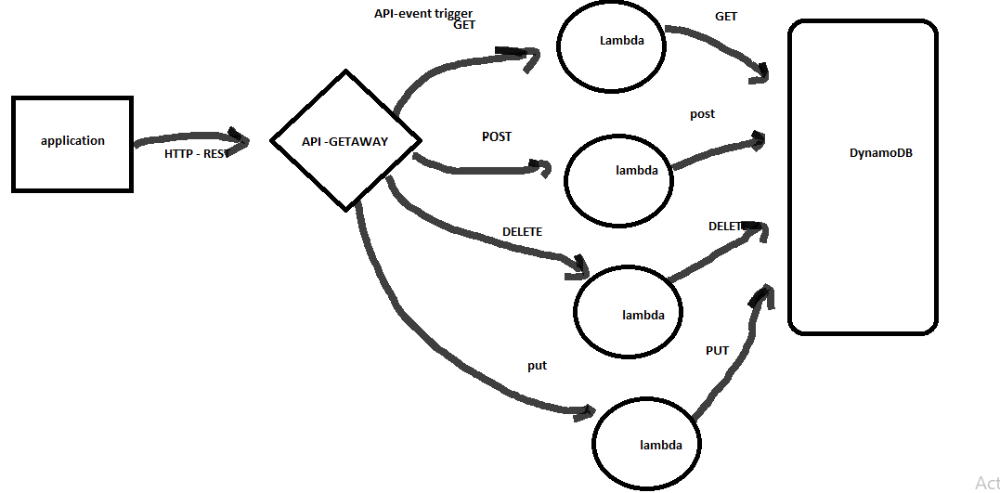

# serverless-api

# What is the root URL to your API?
## Root URL : 
- https://7y6bqsed0l.execute-api.us-east-1.amazonaws.com

 
 

# What are the routes?
## ROUTES:
1. GET: https://7y6bqsed0l.execute-api.us-east-1.amazonaws.com/people

2. PUT: https://7y6bqsed0l.execute-api.us-east-1.amazonaws.com/people/{id}

3. DELETE: https://7y6bqsed0l.execute-api.us-east-1.amazonaws.com/people/{id}

4. POST: https://7y6bqsed0l.execute-api.us-east-1.amazonaws.com/people

5. GET: https://7y6bqsed0l.execute-api.us-east-1.amazonaws.com/people/{id}

 

> Note L Number five is when we want to get an item by its id not the whole object.
 
 

## What inputs do they require  & What output do they return??
1. Getting all the data (General Get): requires Just the Route URL and will return a JSON object containing all the items in it.
2. Get by Id : - inputs : Id
               - output: the item with that id.

3. Post :      - inputs : body of data {name, age , occupation}
               - output: the item created with that data.

4. update by Id : - inputs : Id
                  - output: the item  after update with that id.

5. delete by Id : - inputs : Id
                  - output: empty object showing that the object is deleted.

 
 
 

# UML
